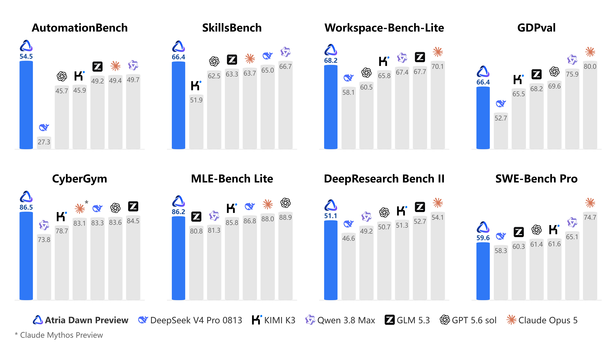

<p align="left">
   <a href="README.md">English</a>&nbsp;｜&nbsp;中文
</p>
<br>

# Atria Dawn Preview: 从研究问题到可验证的结果

<!-- markdownlint-disable first-line-h1 -->
<!-- markdownlint-disable html -->
<!-- markdownlint-disable no-duplicate-header -->

</div>
<div align="center" style="line-height: 1;">
  <a href="https://huggingface.co/internlm/Atria-Dawn-Preview" target="_blank" style="margin: 2px;">
    
  </a>
  <a href="https://www.modelscope.cn/models/Shanghai_AI_Laboratory/Atria-Dawn-Preview" target="_blank" style="margin: 2px;">
    
  </a>
  <a href="LICENSE" style="margin: 2px;">
    
  </a>
</div>

<div align="center" style="line-height: 1;">
  <a href="https://atria-asi.ai/" target="_blank" style="margin: 2px;">
    
  </a>
  <a href="https://github.com/atria-asi/Atria-Dawn-Preview" target="_blank" style="margin: 2px;">
    
  </a>
  <a href="https://x.com/AtriaASI" target="_blank" style="margin: 2px;">
    
  </a>
  <a href="https://discord.gg/jT8SDt8up" target="_blank" style="margin: 2px;">
    
  </a>
</div>

<div align="center"  style="line-height: 1;">
  <a href="https://arxiv.org/abs/2609.15818" target="_blank" style="margin: 2px;">
    
  </a>
</div>

<br>

<div align="center">
  <a href="#介绍">介绍</a> ·
  <a href="#模型下载">模型下载</a> ·
  <a href="#性能评估">性能评估</a> ·
  <a href="#部署和在线使用">部署和在线使用</a> ·
  <a href="#许可证">许可证</a> ·
  <a href="#联系我们">联系我们</a> ·
  <a href="#引用">引用</a>
</div>

## 介绍

Atria Dawn Preview 是由上海人工智能实验室研发的新一代智能体大模型预览版，模型基于 744B MoE GLM-5.2 基座进行训练，面向需要持续理解环境、调用工具并完成多步任务的研究与工程场景。该模型旨在协助用户将开放性问题推进为可执行、可验证和可复现的结果。模型能够结合任务目标与环境反馈，参与问题分析、方案设计、工具调用、代码实现、实验执行、结果分析以及失败恢复等环节。

Atria Dawn Preview 从以下四个维度赋能智能体任务，重点强化了在科研自动化、办公等真实生产力场景下的端到端交付能力。

- **Discovery：** 检索和组织证据，开展深度研究，并将研究问题转化为可执行的实验方案。
- **Creation：** 构建软件、交互应用、游戏、数据可视化和机器学习系统。
- **Delivery：** 将文档、数据和设计要求转化为报告、演示文稿及其他结构化成果。
- **Cybersecurity：** 在经过授权的环境中分析安全问题、验证漏洞、实施修复并完成复验。


## 模型下载

<div align="center">

| **模型名** | **简介** | **上下文** | **Hugging Face** | **ModelScope** |
| :---: | :---: | :---: | :---: | :---: |
| Atria-Dawn-Preview | Instruct 模型 | 256K | [Model](https://huggingface.co/internlm/Atria-Dawn-Preview) | [Model](https://www.modelscope.cn/models/Shanghai_AI_Laboratory/Atria-Dawn-Preview) |
| Atria-Dawn-Preview-FP8 | FP8量化Instruct模型 | 256K| [Model](https://huggingface.co/internlm/Atria-Dawn-Preview-FP8) | [Model](https://www.modelscope.cn/models/Shanghai_AI_Laboratory/Atria-Dawn-Preview-FP8) |

</div>


## 性能评估
我们对Atria Dawn Preview进行了全面评估。以下是部分评测结果。


<div align="center">
  
</div>
<!-- todo: 柱状图注释 -->

<div align="center">

| Benchmark | Atria Dawn Preview | DeepSeek V4 Pro 0813 | KIMI K3 | Qwen 3.8 Max | GLM 5.3 | GPT 5.6 sol | Claude Opus 5 |
| --- | ---: | ---: | ---: | ---: | ---: | ---: | ---: |
| AutomationBench | 53.8 | 41.7 | 45.9 | 49.7 | 49.2 | 45.7 | 49.4 |
| BFCL v4 | 77.0 | 71.4 | 69.1 | - | 74.1 | - | - |
| CyberGym | 86.5 | 83.3 | 78.7 | 73.8 | 84.5 | 83.6 | - |
| DeepSearchQA | 96.0 | - | 95.9 | - | 94.7 | 93.2 | - |
| Workspace-Bench-Lite | 68.2 | 58.1 | 65.8 | 67.4 | 67.7 | 60.5 | 70.1 |
| BrowseComp | 92.5 | 83.4 | 91.2 | - | - | 92.2 | 90.8 |
| SkillsBench | 66.4 | 65.0 | 51.9 | 66.7 | 63.3 | 62.5 | 63.7 |
| Workspace-Bench | 65.0 | 55.7 | 60.6 | 63.9 | 63.9 | 56.0 | 65.8 |
| MLE-bench Lite | 86.2 | 86.8 | 85.8 | 81.3 | 80.8 | 88.9 | 88.0 |
| WideSearch | 81.9 | - | 79.6 | 81.9 | 82.7 | 83.3 | - |
| DeepResearch Bench II | 51.1 | 46.6 | 51.3 | 49.2 | 52.7 | 50.7 | 54.1 |
| τ³-Bench Banking | 41.2 | 44.3 | 37.1 | 55.2 | 40.2 | 46.9 | 48.7 |
| Terminal-Bench 2.1 | 78.3 | 78.7 | - | 89.3 | 85.4 | 85.1 | 90.2 |
| GDPval | 1583 | 1517 | 1611 | 1722 | 1667 | 1682 | 1768 |
| SWE-bench Pro | 59.6 | 58.3 | 61.6 | 65.1 | 60.3 | 61.4 | 74.7 |
| JobBench | 50.3 | 54.1 | 54.3 | 52.7 | 58.2 | 45.4 | 68.0 |

</div>


<!-- ## How to Run Locally

在此补充本地运行、推理服务和环境配置说明。

```bash
# 在此添加安装和运行命令。
``` -->

## 部署和在线使用

Atria Dawn Preview 支持本地部署与在线调用。有关在线调用，请使用您所在地区对应的服务。

| 地区                | 使用链接                                                                  | 教程                                                                        |
| ----------------- | --------------------------------------------------------------------- | ------------------------------------------------------------------------- |
| **国内**         | [Link](https://discovery.intern-ai.org.cn/token-plan/home?tabIndex=0) | [Tutorial](https://discovery.intern-ai.org.cn/token-plan/home?tabIndex=3) |
| **海外** | [Link](https://api.atria-asi.ai/)                                     | [Tutorial](https://api.atria-asi.ai/docs)                                 |

如需进行本地部署，请参考以下部署指南。

- [SGLang](https://github.com/sgl-project/sglang) (v0.5.13.post1+) — 参考 [cookbook](https://cookbook.sglang.io/autoregressive/GLM/GLM-5.2)
- [vLLM](https://github.com/vllm-project/vllm) (v0.23.0+) — 参考 [recipes](https://recipes.vllm.ai/zai-org/GLM-5.2)

### Codex

将自定义 provider 添加到 `~/.codex/config.toml`。Codex 使用 Responses API。

```toml
model = "Atria-Dawn-Preview"
model_provider = "atria"

[model_providers.atria]
name = "Atria"
base_url = "https://api.atria-asi.ai/v1"
env_key = "ATRIA_API_KEY"
wire_api = "responses"
```

#### 将输入限制为纯文本

`Atria-Dawn-Preview` 只接受文本输入。Codex 默认会假设每个模型都支持多模态输入，并会附加通过 `-i/--image` 或 TUI 粘贴的图片；而该端点会因此返回 `400 Atria-Dawn-Preview is not a multimodal model` 错误。需要声明模型支持的输入模态，让 Codex 在客户端直接移除图片输入。

##### 第 1 步：创建模型目录文件

将下面的内容保存为 `~/.codex/atria-catalog.json`：

```json
{
  "models": [
    {
      "slug": "Atria-Dawn-Preview",
      "display_name": "Atria-Dawn-Preview",
      "base_instructions": "你是运行在 Codex CLI 中的编程代理。你将在共享工作区中与用户协作，完成软件工程目标。\n\n你只能接收文本输入。你无法获取图片、截图、PDF 或其他二进制附件。如果用户提到你无法查看的附件，请直接说明这一点，并要求用户粘贴相关文本。",
      "supported_reasoning_levels": [
        { "effort": "low", "description": "快速响应，使用较轻量的推理" },
        { "effort": "medium", "description": "在速度和推理深度之间保持平衡" },
        { "effort": "high", "description": "为复杂问题提供更深入的推理" }
      ],
      "shell_type": "unified_exec",
      "visibility": "list",
      "supported_in_api": true,
      "priority": 1,
      "support_verbosity": false,
      "truncation_policy": { "mode": "tokens", "limit": 10000 },
      "experimental_supported_tools": [],
      "context_window": 256000,
      "max_context_window": 256000,
      "input_modalities": ["text"]
    }
  ]
}
```

`"input_modalities": ["text"]` 是禁用多模态输入的设置。

将 `context_window` / `max_context_window` 设置为模型实际支持的上限。Codex 会使用这些值来规划提示词，并判断何时自动压缩上下文。如果不设置，Codex 会采用较为保守的默认值，从而浪费可用的上下文空间。

解析器要求其他所有字段都必须存在。缺少任何一个字段都会导致 `missing field <name>` 错误，Codex 也将无法启动。

##### 第 2 步：让配置指向该文件

```toml
model = "Atria-Dawn-Preview"
model_provider = "atria"
model_catalog_json = "~/.codex/atria-catalog.json"

[features]
view_image = false

[model_providers.atria]
name = "Atria"
base_url = "https://api.atria-asi.ai/v1"
env_key = "ATRIA_API_KEY"
wire_api = "responses"
```

`features.view_image = false` 是可选设置。它会移除图像查看工具，避免模型尝试调用一个会被拒绝的工具。

> **重要：** `model_catalog_json` 会**替换**模型目录，而不是与其合并。任何未列在该文件中的模型都会回退到默认元数据，而默认元数据会假设模型支持多模态输入，并记录 `warning: Model metadata for <slug> not found` 警告。如果你使用 `-m` 切换模型，或通过编辑 `model` 切换模型，请将该模型也添加到同一个文件中，否则纯文本限制不会应用于该模型。

要求 Codex CLI 版本为 0.154.0 或更高版本。

### Claude Code

```python
#!/usr/bin/env python3
"""
PreToolUse 钩子：阻止 Read 工具读取 PDF 和图片文件。
"""
import json
import sys


IMAGE_EXTENSIONS = (
    ".apng",
    ".avif",
    ".bmp",
    ".gif",
    ".heic",
    ".heif",
    ".ico",
    ".jfif",
    ".jpeg",
    ".jpg",
    ".jxl",
    ".png",
    ".svg",
    ".tif",
    ".tiff",
    ".webp",
)


def main():
    hook_input = json.loads(sys.stdin.read())
    file_path = hook_input.get("tool_input", {}).get("file_path", "")

    if file_path.lower().endswith(".pdf"):
        reason = "不允许使用 Read 工具读取 PDF 文件。"
    elif file_path.lower().endswith(IMAGE_EXTENSIONS):
        reason = "不允许使用 Read 工具读取图片文件。"
    else:
        sys.exit(0)

    output = {
        "hookSpecificOutput": {
            "hookEventName": "PreToolUse",
            "permissionDecision": "deny",
            "permissionDecisionReason": reason,
        }
    }
    print(json.dumps(output, ensure_ascii=False))

    sys.exit(0)


if __name__ == "__main__":
    main()
```

请将上面的代码保存为 `${Target_dir}/block_pdf_image_read.py`，并确保使用绝对路径。

将它添加到 `~/claude_dir/settings.json` 中。

这样可以在 `PreToolUse` 阶段拦截图片、PDF 等多模态输入。

```bash
"hooks": {
    "PreToolUse": [
      {
        "matcher": "Read",
        "hooks": [
          {
            "type": "command",
            "command": "python3 ${Target_dir}/block_pdf_image_read.py",
            "timeout": 5
          }
        ]
      },
      {
        "matcher": "",
        "hooks": []
      }
    ]
}
```


## 许可证

本仓库的代码和权重依照MIT协议开源。

<!-- ## Citation

```text
在此添加正式引用信息。
``` -->

## 联系我们
如有问题或建议，欢迎通过邮件或GitHub等平台联系我们。

- 📱 **微信社群** — 扫描下方任一二维码加入 Atria 交流群

<p align="center">
  
  
  
</p>

## 引用
```
@misc{guo2026atriadawndawnagentic,
      title={Atria Dawn: The Dawn of Agentic Superintelligence}, 
      author={Honglin Guo and Tao Gui and Yicheng Chen and Guanting Dong and Qiming Ge and Yuyang Hu and Zixian Huang and Jiajie Jin and Alexander Lam and Yining Li and Jiahang Lin and Yanjiang Liu and Xinyu Lu and Haijun Lv and Junlin Shang and Qisheng Su and Guoqiang Wang and Rui Wang and Zhecan Wang and Hao Xiang and Xinchen Xie and Shuhao Xing and Xiaoyu Xing and Wanghan Xu and Xinyu Yang and Yajie Yang and Chengfeng Zhao and Haoran Zhao and Ruojun Zhou and Yunhua Zhou and Yicheng Zou and Kun Cai and Qiye Cai and Xinmeng Che and Haodong Chen and Jiabei Chen and Jiahao Chen and Jiayi Chen and Yujia Chen and Lizhi Cui and Youheng Dai and Xin Deng and Yi Dong and Shihan Dou and Chenya Gu and Xu Guo and Ding Han and Feiyang Hao and Haotan He and Jie Hou and Binze Hu and Zijian Hu and Junhao Huang and Huicheng Jiang and Jiazhen Jiang and Shufan Jiang and Jiahao Kuang and Bowen Lai and Bo Li and Jiaqiang Li and Peng Li and Qilong Li and Zhuoqun Li and Jiaxiang Liu and Shuainan Liu and Tong Liu and Yi Liu and Zhonghang Lu and Jianwen Luo and Yanyi Luo and Huijie Lv and Ningsheng Ma and Zerun Ma and Houcheng Min and Chengjun Pan and Qiyuan Peng and Xiaoxuan Peng and Jianmin Qian and Jiantao Qiu and Wanying Ren and Huayu Sha and Jifei Shan and Zixin Shang and Bing Shao and Zhuohui Sheng and Jiayang Shi and Yang Shu and Aierpanjiang Simayi and Sirui Song and Yuxiao Song and Zhe Sun and Zhichao Sun and Wenzhe Tan and Wenhui Tian and Zhongbo Tian and Hanchen Wang and Pengbo Wang and Rui Wang and Yiding Wang and Yuhui Wang and Zhiheng Xi and Caijun Xu and Chao Xu and Yongfeng Xu and Xiaolei Yang and Zhixiong Yang and Qian Yao and Shihong Yi and Yuankai Ying and Jia Yu and Dingbo Yuan and Hao Yuan and Junjie Yuan and Bo Zhang and Caixian Zhang and Qiuyinzhe Zhang and Jiyuan Zhao and Penghao Zhao and Ying Zhao and Pujun Zheng and Xiaoxue Zhong and Xiaohao Zhou and Xinyu Zhou and Dongsheng Zhu and Guanru Zhu and Yulun Zhu and Yaojie Lu and Tao Ji and Hongyu Lin and Yutao Zhu and Pengfei Cao and Guoxiu He and Xianpei Han and Ben He and Zhicheng Dou and Kang Liu and Qi Zhang and Le Sun and Jun Zhao and Ji-Rong Wen and Xuanjing Huang and Yu-Gang Jiang and Bowen Zhou},
      year={2026},
      eprint={2609.15818},
      archivePrefix={arXiv},
      primaryClass={cs.AI},
      url={https://arxiv.org/abs/2609.15818}, 
}
```
